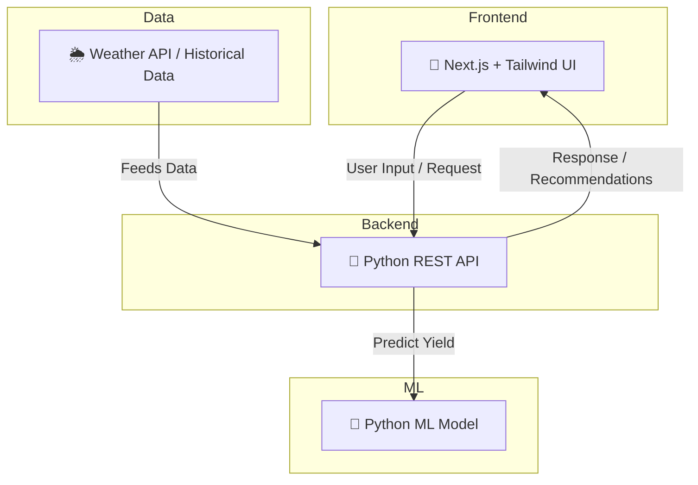

```mermaid
graph TD
    subgraph Frontend
        A[📱 Next.js + Tailwind UI]
    end

    subgraph Backend
        B[🚀 Python REST API]
    end

    subgraph ML
        C[🧠 Python ML Model]
    end

    subgraph Data
        F[🌦 Weather API / Historical Data]
    end

    A --> |"User Input / Request"| B
    F --> |"Feeds Data"| B
    B --> |"Predict Yield"| C
    B --> |"Response / Recommendations"| A

```
